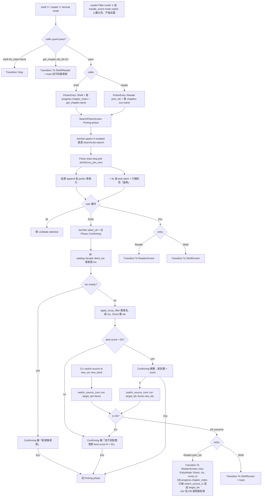
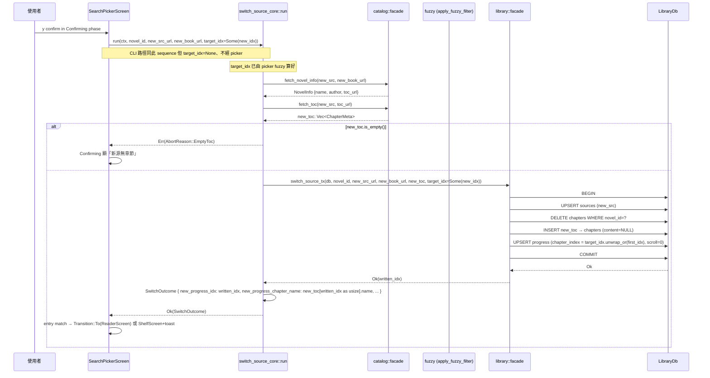
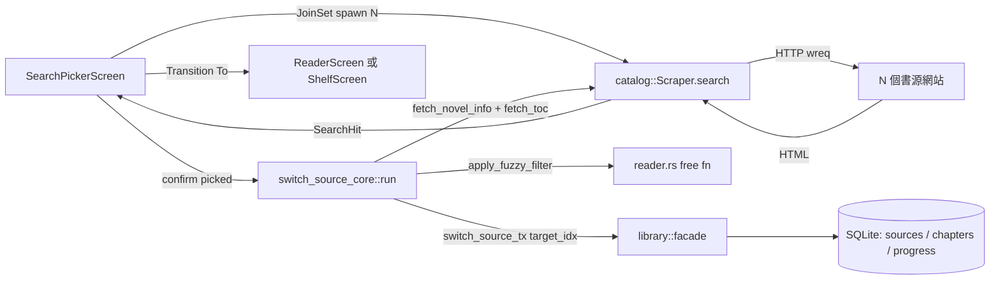

# Design

## 系統架構

本次變動跨 `presentation/handlers/tui/` + `presentation/handlers/switch_source_core` + `library/facade` + `library/dao` 四個層次。新增一個 TUI screen + 一個 `SearchLike` trait (testability seam)；既有 5 個 fn / trait method 簽名同步擴 `target_idx: Option<i64>`。

**新增 components**：
- `SearchPickerScreen`（新 `tui/picker.rs`）— 單一 Screen impl 但內部 `Phase` enum 分 Picking / Confirming
- `PickerEntry` enum — `Reader { previous_chapter_idx: i64 }` / `Shelf`（非 reuse 既有 reader `EntryMode`，語義不同）
- `SearchLike` trait（pub(crate) in picker.rs）— testability seam for picker UT
- `SearchResult` struct — picker 表格一行的所有資料（src_url / book_name / author / chapter_count / status）
- `SearchStatus` enum — Loading / Ok / Timeout / Failed
- `SwitchOutcome.new_progress_chapter_name: String` — 新欄位（switch_source_core.rs）

**簽名擴**：
- `apply_fuzzy_filter(query, chapters)` → `(query, chapters, anchor: Option<i64>) -> Vec<(usize, i64)>`
- `switch_source_core::run(... )` → `(..., target_idx: Option<i64>)`
- `SwitchSourceDeps::switch_source_tx(...)` → `(..., target_idx: Option<i64>)`
- `library::facade::switch_source_tx(...)` → `(..., target_idx: Option<i64>)`
- `library::dao::update_book_source_tx_inner` step 4 改 `target_idx.unwrap_or(first_idx)`

**刪除**：
- `tui/switch_source.rs` 整檔（兩欄手 paste UX）
- `tui/mod.rs` 內 `pub mod switch_source` 行
- 既有 SwitchSourceScreen 相關 UT（in tui/switch_source.rs::tests）

**CLI handler 整合點（mermaid CLIEntry 對應）**：

`src/presentation/handlers/switch_source.rs`（CLI 入口、非 tui/）既有呼 `switch_source_core::run(ctx, novel_id, src, book_url)` 將補 `target_idx: None` 參數；不引入 picker streaming UX、不接 fuzzy mapping；行為與本次擴前等價（永遠 fall back first_idx）。E2E-06 與 INT-regression-cli-04 驗。

## 整體操作流程



## 畫面關聯

```mermaid
stateDiagram-v2
    [*] --> Shelf: 一般進入
    [*] --> Reader: 從 menu 或 CLI 開 reader
    
    Shelf --> Picker_Picking_S: 按 s
    Reader --> Picker_Picking_R: Normal mode 按 s
    Reader --> Reader: Filter mode 按 s (s 進 query)
    
    Picker_Picking_S --> Picker_Confirming_S: Enter
    Picker_Picking_R --> Picker_Confirming_R: Enter
    
    Picker_Confirming_S --> Picker_Picking_S: Esc 或 score<=50 abort
    Picker_Confirming_R --> Picker_Picking_R: Esc 或 score<=50 abort
    
    Picker_Picking_S --> Shelf: Esc
    Picker_Picking_R --> Reader: Esc
    
    Picker_Confirming_S --> Shelf: y confirm + toast
    Picker_Confirming_R --> Reader_Rebuild: y confirm (ReaderScreen::new EntryMode::Direct)
    Reader_Rebuild --> Reader: DB progress 已寫新 idx、ctor 從 DB 讀即跳對章
```

## API Sequence — picker confirm 後資料流



## 整體資料流



無循環。Scraper / DB 已是既有 invariant 不動。

## 資料模型

新增 picker 相關（picker.rs 內部）：

```
pub(crate) enum PickerEntry {
    Reader { previous_chapter_idx: i64 },
    Shelf,
}

pub(crate) enum Phase {
    Picking,
    Confirming {
        selected_idx: usize,                  // picker 表格內被選中行
        sync_state: SyncState,
    },
}

pub(crate) enum SyncState {
    Pending,                                  // 還在 sync_toc / fuzzy
    Ok { new_idx: i64, new_chapter_name: String, score: i64 },
    Abort { reason: AbortKind },              // EmptyToc / FuzzyBelowThreshold
    Err { msg: String },                      // 其他 fetch / DB Err
}

pub(crate) enum AbortKind {
    EmptyToc,
    FuzzyBelow(i64),                          // 帶 best score 顯給使用者
}

pub(crate) struct SearchResult {
    pub(crate) src_url: String,
    pub(crate) status: SearchStatus,
    pub(crate) hit: Option<SearchHit>,        // Some 才能 confirm
}

pub(crate) enum SearchStatus {
    Loading,
    Ok,
    Timeout,
    Failed { msg: String },
}

pub(crate) struct SearchPickerScreen {
    novel_id: i64,
    book_name: String,
    author: String,
    old_chapter_idx: i64,                     // 舊源當前章節 idx（anchor）
    old_chapter_name: String,                 // 舊源當前章節名（fuzzy query）
    entry: PickerEntry,
    
    phase: Phase,
    results: Vec<SearchResult>,
    list_state: ListState,
    
    join_set: Option<JoinSet<(String, SearchStatus, Option<SearchHit>)>>,
}

#[async_trait::async_trait(?Send)]
pub(crate) trait SearchLike {
    async fn search(&self, source: &BookSource, keyword: &str) -> Result<Vec<SearchHit>>;
}

impl SearchLike for catalog::service::scraper::Scraper {
    async fn search(&self, source: &BookSource, keyword: &str) -> Result<Vec<SearchHit>> {
        self.search(source, keyword).await   // 既有 Scraper 已 export search
    }
}
```

`SearchHit` 已是 catalog::SearchHit（既有）。

`PickerEntry::Reader.previous_chapter_idx` 用於 Esc 取消後回 reader 恢復原 chapter idx；reader-entry confirm 走 `outcome.new_progress_idx`、不用 previous_chapter_idx（previous 是 Esc 路徑專用）。

**簽名變動**：

```
// apply_fuzzy_filter（reader.rs:364）
// 原
pub(crate) fn apply_fuzzy_filter(query: &str, chapters: &[ChapterMeta]) -> Vec<usize>
// 新
pub(crate) fn apply_fuzzy_filter(query: &str, chapters: &[ChapterMeta], anchor: Option<i64>) -> Vec<(usize, i64)>

// switch_source_core::run
// 原
pub async fn run(ctx: &mut AppContext, novel_id: i64, new_src_url: &str, new_book_url: &str) -> Result<SwitchOutcome, AbortReason>
// 新
pub async fn run(ctx: &mut AppContext, novel_id: i64, new_src_url: &str, new_book_url: &str, target_idx: Option<i64>) -> Result<SwitchOutcome, AbortReason>

// SwitchSourceDeps::switch_source_tx
// 原
async fn switch_source_tx(&mut self, db: &mut LibraryDb, novel_id: i64, src: &str, book_url: &str, toc: Vec<ChapterMeta>) -> Result<i64>
// 新
async fn switch_source_tx(&mut self, db: &mut LibraryDb, novel_id: i64, src: &str, book_url: &str, toc: Vec<ChapterMeta>, target_idx: Option<i64>) -> Result<i64>

// library::facade::switch_source_tx 同上

// SwitchOutcome
// 原（switch_source_core.rs:67）
pub struct SwitchOutcome {
    pub new_progress_idx: i64,
    pub new_first_chapter_name: String,
    pub chapter_count: i64,
}
// 新（加一欄）
pub struct SwitchOutcome {
    pub new_progress_idx: i64,
    pub new_first_chapter_name: String,        // 保留供 CLI target_idx=None 路徑
    pub new_progress_chapter_name: String,     // 新加 — = new_toc[new_progress_idx as usize].name
    pub chapter_count: i64,
}
```

## 錯誤處理策略

**Picker 層**：
- 任一書源 search Err / Timeout → SearchResult.status = Failed / Timeout、該行灰色、不阻塞其他
- Enter 時若 selected row 是 Loading / Timeout / Failed → no-op 不切 phase
- Confirming sync_state = Pending 期間 y / Esc 收：y nop、Esc 回 Picking phase
- Confirming 進入失敗（fetch_toc Err / EmptyToc / fuzzy < 50）→ Confirming sync_state = Abort/Err、顯訊息、Esc 回 Picking
- picker drop（Esc 或 Transition 離開）→ `join_set.take()` Drop → tokio cancel pending tasks（**spike 點：見 Unknowns**）

**switch_source_core 層**：
- 既有 AbortReason 5 case（FetchInfo / FetchToc / EmptyToc / SourceUpsert / SwitchTx）保留、不增 case
- `target_idx: Some(N)` 但 `N >= new_toc.len()` 為 invalid input → 視為 None fall back first_idx（防禦性、避免 panic on `toc[N]` index out of bounds）
- 「target_idx 越界」picker 端不該發生（picker 把 fuzzy 算出的 new_idx 從 0..new_toc.len() 範圍內傳）；但 defensive 補

**library facade / dao 層**：
- target_idx=None fall back first_idx；空 toc 由 caller (`switch_source_core`) 在進 switch_source_tx 前已 abort（reuse 既有 `evaluate_toc` 路徑）
- tx rollback 沿用既有 `update_book_source_tx_inner` BEGIN..COMMIT 結構
- SwitchOutcome.new_progress_chapter_name 由 switch_source_core 在 facade tx 回來後組裝（不入 facade 簽名、facade 仍回 `Result<i64>` 寫入值）

**Reader Filter mode**：
- 既有 Filter mode `KeyCode::Char(c)` arm 已 append query；`s` 落這 arm、不會走 picker 入口（reader handle_event 在進 Normal mode arm 前先 match mode）

**Picker 入口前置 (caller-side guards)** — REQ-005 + edge cases (c) 的 caller-side 統一處理：
- **shelf 空 / list_state.selected()=None** → 不開 picker、`Transition::Stay`（既有 `d` 鍵相同 pattern）
- **`library::facade::get_chapter(novel_id, old_idx)` Err 或 None** → 不開 picker、回 caller 帶 toast「找不到舊章節，無法換源」；shelf-entry 走 `ShelfScreen::with_highlight_until(.., Some(toast), TTL)`、reader-entry 走 toast set 在 reader.toast / toast_expires_at（reuse 既有 reader toast pattern）
- **0 enabled 書源** → picker 構造後 spawn 0 task、表格永遠空；任何 Enter no-op（picker 內部行為）；caller 不前置 guard、由 picker 內部表格空提示「無 enabled 書源」（advisory 文案、不阻塞）
- **`ReaderScreen::new(EntryMode::Direct, ctx, novel_id)` confirm 完成後重建失敗**（chapters table 空 / get_progress 失敗 / init_buffer Err）→ ReaderScreen ctor 內既有 B1 邊界 propagate Err；picker 端 catch、fall back `Transition::To(ShelfScreen + toast「換源成功但 reader 載入失敗」)`

## Testability seams

**Seam 1 — SearchLike trait**：picker UT 用 `MockSearchScraper { by_src: HashMap<String, Result<Vec<SearchHit>>>, delays: HashMap<String, Duration> }` 注入；production 用 `catalog::service::scraper::Scraper` 直接 impl `SearchLike`。Seam 是 implementation affordance、不對應使用者可見需求 Scenario（requirement.md 無顯式要求 trait 存在屬正常）。

**Seam 2 — picker 內 sync_toc + fuzzy + switch_tx 不直接呼 ctx.scraper / ctx.db**：picker confirm 路徑包成 `async fn run_switch_with_target<S: SwitchSourceDeps>(deps, ...)` 取代直接呼 `switch_source_core::run`（既有 RealDeps + fault-injection UT pattern reuse；新加 mock 路徑驗 target_idx=Some 寫入）。

**Seam 3 — caller-aware Transition 拆 free fn**：`fn next_transition(entry: &PickerEntry, novel_id: i64, outcome: &SwitchOutcome) -> Transition`（free fn、UT 直接呼）— 驗 entry=Reader → ReaderScreen / entry=Shelf → ShelfScreen+toast。

**Seam 4 — fuzzy mapping 抽 helper**：`fn pick_best_with_anchor(scored: &[(usize, i64)], anchor: Option<i64>) -> Option<(usize, i64)>` — primary score desc / secondary `|new_idx as i64 - anchor| asc` / anchor=None 走 stable order；free fn、UT 直接驗。

**Seam 5 — ratatui TestBackend draw round-trip**：picker draw 既有 streaming 行為以 TestBackend 跑一輪 frame、verify 表格行數與 status text（同 INT-hit-04 pattern）— 用於 INT-picker-draw 系列 UT。

## 與既有架構整合點

- **Cargo.toml**：不加 dep（KD1）；既有 `tokio` 已 enable JoinSet feature（cargo tree 確認）
- **`async_trait`**：`SearchLike` 用 `#[async_trait::async_trait(?Send)]`（與既有 ScraperLike / Screen 同套）
- **`shelf-delete` toast pattern reuse**：picker 完成 → shelf transition 帶 toast 走 `ShelfScreen::with_highlight(book_url, Some(toast))` 或 `ShelfScreen::with_highlight_until(..., toast_expires_at)` 既有 ctor；TOAST_TTL 3 秒 reuse
- **既有 `ReaderScreen::new(EntryMode::Direct, ctx, novel_id)` ctor reuse**：picker 完成 → reader transition 走 **既有 ctor**、不必新加 `with_chapter` variant；switch_source_tx 已把 `progress.chapter_index` 寫成 target_idx，ReaderScreen ctor 內 `library::facade::get_progress(novel_id)` 讀回新值、init_buffer 自然以新 idx 為 curr 起手；既有 `App::new_with_direct_reader` pattern 可直接 reuse 或 picker 端直接 `Box::new(ReaderScreen::new(...).await?)`
- **CLI handler `presentation/handlers/switch_source.rs`（CLI 入口、非 tui/）**：既有呼點補 `target_idx=None` 參數、行為與本次擴前等價（CLI 不接 target_idx 入參、永遠 fall back first_idx；mermaid 流程圖 CLIEntry 旁路節點對應此路徑）
- **`catalog::facade`**：不動 export；picker 用 `catalog::facade::list_sources` 取 enabled 書源、用 `catalog::facade::get_source(url)` 拿 BookSource、用 `catalog::service::scraper::Scraper.search` 直接呼（既有 invariant：「facade 不 export search」維持，picker handler 走 scraper.search 直接）

## 與 5/27 ship 既有架構的衝突檢查

| 既有 invariant | 本次擴是否衝突 |
|---|---|
| ChapterBuffer / RebuildError / ScraperLike | 不衝突（picker 不動 reader buffer，是另一個 trait） |
| ReaderMode { Normal, Filter } | 不衝突（picker entry 走 Normal mode arm；Filter 不開 picker） |
| reader.rs:862/902 apply_fuzzy_filter callers | wrapper `.into_iter().map(|(i,_)| i).collect()` 兼容 |
| reader.rs:1938/1957/1959 test asserts | wrapper 同上、行為斷言不變 |
| Mouse handlers (try_mouse_wheel / handle_filter_key) | 不動 |
| shelf-delete delete_novel_tx + DeleteConfirmScreen | 不動 |
| TOAST_TTL + toast_active pattern | reuse、不動 |
| EntryMode { Menu, Direct } in reader | reader 既有 EntryMode 保留；新 PickerEntry 為 picker 專用、不 reuse |
| novels.book_url 自然鍵 | 不動（switch_source_tx 既有契約） |
| BookSource serde rename | 不動 |
| 既有 catalog / library / backup bounded context invariant | 不違反 |
