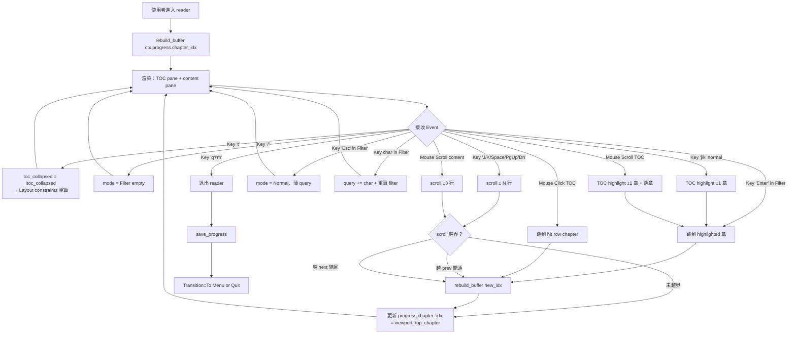
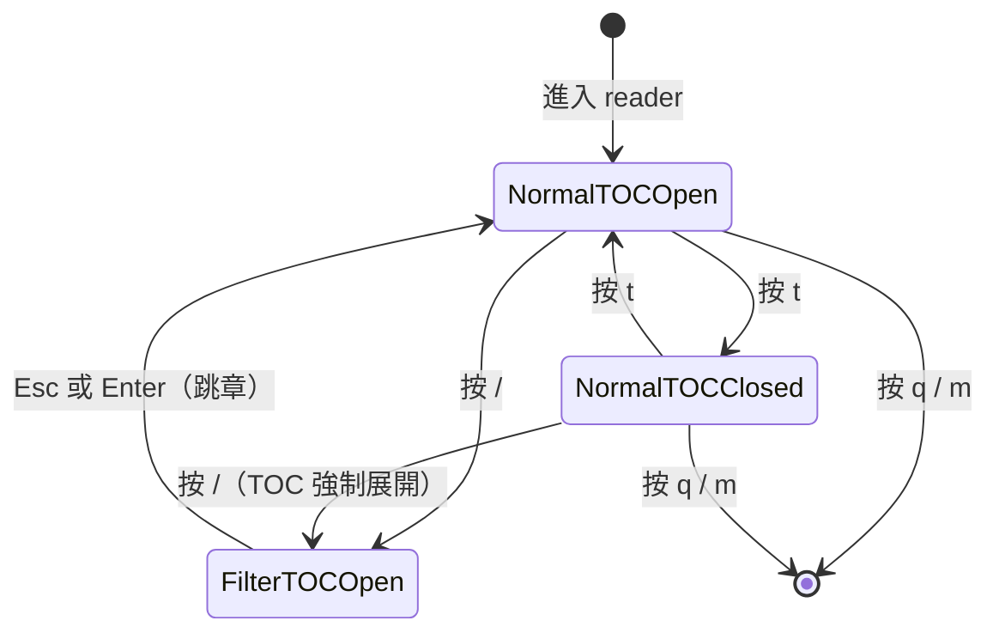
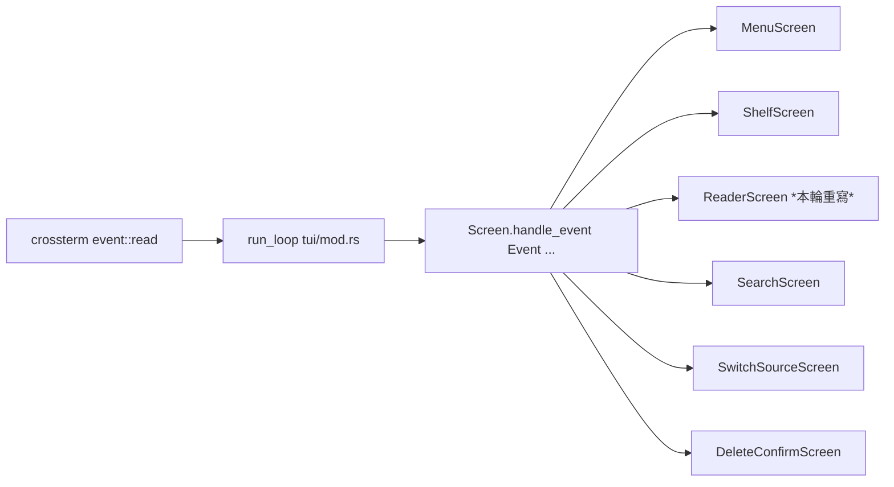
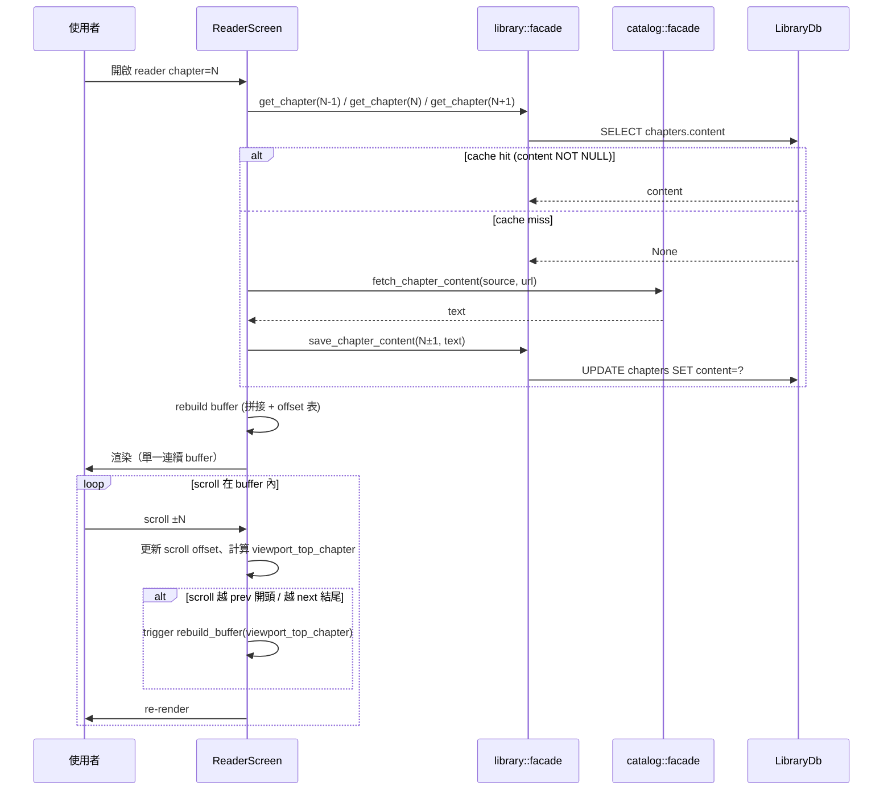
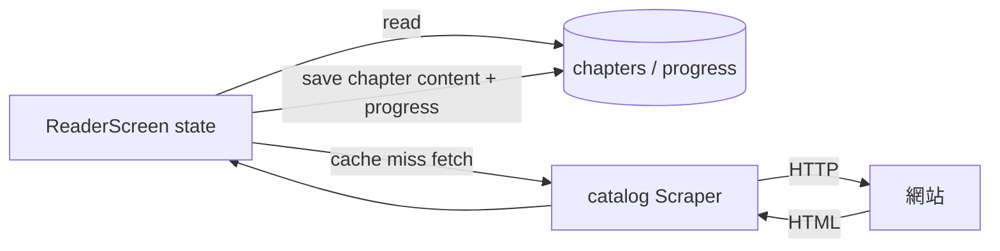

# Design

## 系統架構

本次變動集中在 `presentation/handlers/tui/` 模組，不動 library / catalog / backup 三個 bounded context。架構上有兩層改動：

**1. Infra 層（Screen trait + run_loop）**

- `Screen` trait：`handle_event(KeyEvent, ...)` → `handle_event(Event, ...)`，將 mouse / 其他未來 event 統一進同一漏斗
- `run_loop`：原本 `let Event::Key(key) = event::read()? else { continue }` 拋棄 mouse；改為接受 `Event::Key | Event::Mouse`，forward 給當前 screen。**其他 event type（Resize / Paste / FocusGained）run_loop 直接 `continue` 不 forward**（screen 不會看到這些 event，無須處理）

**2. ReaderScreen 重寫**

由「single-chapter cursor」模型重構為「**Eager 3-chapter buffer + mode state machine**」：

- **Buffer model**：state 持 `prev_chapter / current_chapter / next_chapter` 三章 ChapterContent，拼成單一 String `combined_text` + offset 表 `ChapterOffsets { prev_end_row, curr_end_row }`
- **Mode state machine**：`ReaderMode::Normal` vs `ReaderMode::Filter { query: String, filtered_indices: Vec<usize>, selected: usize }`
- **TOC width toggle**：`toc_collapsed: bool`，影響 Layout constraints
- **Pane hit-test**：mouse event 用 `MouseEvent.column` 與當前 TOC width 判 pane

新增 helper module（不開新 file，放 reader.rs 內）：
- `fn rebuild_buffer(curr_idx, ctx) -> Result<Buffer>`：fetch 三章 + 拼接 + offset 表
- `fn viewport_top_chapter(buffer, scroll) -> i64`：以 scroll 推算 viewport top 所屬章節
- `fn hit_test_pane(column, toc_width) -> Pane`：mouse pane 判斷
- `fn apply_fuzzy_filter(query, chapters) -> Vec<usize>`：用 SkimMatcherV2 排序回 chapter index

## 整體操作流程



## 畫面關聯

reader 為單一 screen，但有 4 個 visual layout 狀態（不是 screen 切換）：



> 設計決策：filter mode 進入時若 TOC 是收合狀態，強制展開（filter 需要看 TOC 列表）。退出 filter mode 後 toc_collapsed 不還原（用戶若想收回得再按 t）— 這條留作 future polish 議題，本輪行為是「強制展開且不還原」。對應 INT-mode-04 UT 驗。

> 設計決策：**Filter mode 下所有 printable `KeyCode::Char` 一律走 AppendQuery、不分派 normal binding**（含 `t`、`/`、`j`、`k` 等）— 否則 query 永遠無法輸入這些字元。`j/k` 在 Filter mode 改成移動 `filtered_indices` 中的 `selected`。Esc、Enter、Backspace 是控制鍵不受此規則。

> 設計決策：**Mouse click on TOC in Filter mode 等同 Enter 路徑** — 點某 row 跳到 `chapters[filtered_indices[row]]` 並退出 filter mode、清 query。這跟 REQ-005 S4 一致；route 上走 JumpTo → RebuildBuffer。

## Screen trait migration 影響範圍



每個 screen 配合的改造模板：

| Screen | KeyEvent 行為 | MouseEvent 行為 | 其他 Event |
|---|---|---|---|
| Menu | 既有不變 | `Transition::Stay` | 不收到（run_loop continue 吃掉） |
| Shelf | 既有不變 | `Stay`（本輪不加 mouse 支援，未來輪可加） | 不收到 |
| Reader | 既有 + 新 binding | 新加（wheel + click） | 不收到 |
| Search | 既有不變 | `Stay` | 不收到 |
| SwitchSource | 既有不變 | `Stay` | 不收到 |
| DeleteConfirm | 既有不變 | `Stay` | 不收到 |

## Eager 三章 buffer 資料流



注意這裡的「並行 fetch」實作策略屬 unknown（見 goal.md），design 不鎖死；可選 `tokio::join!` 或序列 fetch。Catalog facade 已是 async。

## 整體資料流



無循環、無新外部依賴。

## 資料模型

新增的 in-memory 結構（不持久化、不動 schema）：

```
ReaderScreen {
  // 既有保留
  novel_id: i64
  entry_mode: EntryMode
  chapters: Vec<ChapterMeta>
  current: usize                // 當前 viewport top 所屬章節 idx
  scroll: u16                   // scroll offset (rows)
  focus: Focus                  // Toc / Content
  content_area_h: u16

  // 新增
  buffer: ChapterBuffer
  toc_collapsed: bool           // false = 30%, true = 0%
  toc_width_cached: u16         // draw() 時記下、mouse handler 取用（同 content_area_h pattern）
  mode: ReaderMode
  toc_list_state: ListState
  toast: Option<String>         // reuse shelf-delete 引入的 toast 機制
  toast_expires_at: Option<Instant>
}

ChapterBuffer {
  combined_text: String          // prev + "\n\n" + curr + "\n\n" + next
  prev_chapter_idx: Option<i64>
  curr_chapter_idx: i64
  next_chapter_idx: Option<i64>
  prev_end_row: u16              // buffer 中 prev 章內容結束的 row
  curr_end_row: u16              // buffer 中 curr 章內容結束的 row
                                 // next 章從 curr_end_row+2（分隔空行）開始到結尾
}

enum ReaderMode {
  Normal,
  Filter {
    query: String,
    filtered_indices: Vec<usize>,   // chapters 中命中的 idx，按 score 降序
    selected: usize,                 // filtered_indices 內的 highlight
  },
}

enum Pane {
  Toc,
  Content,
}
```

**Trait sig 變動：**

```
// 原
async fn handle_event(&mut self, key: KeyEvent, ctx: &mut AppContext) -> Transition;

// 新
async fn handle_event(&mut self, event: Event, ctx: &mut AppContext) -> Transition;
```

## Toast 機制 reuse 自 shelf-delete

reader 的錯誤提示 toast（如「載入第 N 章失敗」）reuse shelf-delete worktree 引入的 `presentation/handlers/tui/mod.rs::TOAST_TTL` 常數（3 秒）與 menu / shelf 的 `toast_active()` pattern：
- `toast: Option<String>` + `toast_expires_at: Option<Instant>` 兩欄位
- `toast_active(&self) -> Option<&str>` getter（用 `Option::filter` 判過期）
- draw() 用 `toast_active()` 而非直接讀 `toast`
- 任意鍵按下時清 toast + reset `toast_expires_at`

不重複造輪子；trait migration 後 import path 為 `crate::presentation::handlers::tui::TOAST_TTL`。

## E2E-08 對應 trait migration 影響範圍

E2E-08 不在「整體操作流程」flowchart 中（那張圖只畫 reader 內部行為），而是對應「Screen trait migration 影響範圍」表格中每個 screen 的 `KeyEvent 行為 = 既有不變` invariant。手動驗收方式：對 6 個 screen 各按一次它們既有的代表性 binding，行為與本輪 trait 改動前一致。

## Testability seams（spec-mandated，/execute 必須建立）

reader 是 stateful + async + 依賴外部資源（DB / Scraper / terminal），UT 需要可注入點。本 spec 規定以下 4 個 seam 必須在實作期建立：

### Seam 1：Scraper injection

`ReaderScreen` 在 cache miss 時透過 `catalog::facade::fetch_chapter_content` 抓內容。為了讓 INT-buffer-01..06 / INT-jump-01..03 等 UT 能 mock fetch 行為，必須有以下其中一個機制：

- 方案 A：`AppContext.scraper` 改為 `Arc<dyn Scraper>` trait object（影響所有 use scraper 的地方，較重）
- 方案 B：reader 加 `with_scraper_for_test(...)` ctor 接受任意 `impl Scraper`（影響小，僅 reader 模組）

**推薦方案 B**，與既有 `switch_source_core::SwitchSourceDeps` mock pattern 風格一致（見 switch_source_core.rs:79-118）。

### Seam 2：run_loop 重構為 test-friendly inner fn

INT-trait-04（run_loop forward Mouse）與 INT-trait-05（continue Resize/Paste/Focus）需要注入 event source + 終端。`run_loop` 重構：

- 公開 `run_loop(app: App) -> Result<()>` 保留原 signature（thin wrapper）
- 內部 `run_inner<E: EventSource, T: Terminal>(app, events, term) -> Result<()>` 是 testable seam
- `EventSource` trait（pub(crate)）：`fn poll(&mut self, dur: Duration) -> Result<bool>` + `fn read(&mut self) -> Result<Event>`
- production 用 crossterm `event::poll` / `event::read` 實作；test 用 `Vec<Event>` queue mock

### Seam 3：純函數抽出

以下行為抽為 free fn（非 method）方便 UT 直接呼：

- `fn progress_text(buffer: &ChapterBuffer, scroll: u16, total: usize) -> String` — INT-progress-01 直接驗
- `fn hit_test_pane(column: u16, toc_width: u16) -> Pane` — INT-hit-01..03 直接驗
- `fn hit_test_toc_row(row: u16, list_offset: u16, items_count: usize) -> Option<usize>` — INT-hit-04 直接驗（也消除「1-caller helper」的 architecture finding；UT 是第 2 個 caller）
- `fn viewport_top_chapter(buffer: &ChapterBuffer, scroll: u16) -> i64` — INT-viewport-01..03 直接驗
- `fn apply_fuzzy_filter(query: &str, chapters: &[ChapterMeta]) -> Vec<usize>` — INT-mode-02/03 直接驗
- `fn apply_jump_to(reader_state, target_idx) -> Result<()>` — INT-jump-01a 驗內部跳章邏輯（mouse-03 的 INT-jump-01b 驗 click 入口）

### Seam 4：ratatui TestBackend 用於 draw 驗證

INT-hit-04（toc_width round-trip）需要實際跑一次 `reader.draw(frame)` 才能驗 `toc_width_cached` 被更新。用 `ratatui::backend::TestBackend::new(80, 24)` + `Terminal::new(backend)` + `terminal.draw(|f| reader.draw(f, &ctx))` 跑一輪，再讀 reader.toc_width_cached 驗。

---

## 為什麼選 Eager 三章 buffer 而不是 Lazy 拼接（KD 記錄）

User Round 3.5 明選 Eager。決策記錄：

- **Eager 的優點**：跨章邊界滾動瞬間有內容（buffer 已含 prev/next）、零延遲、視覺上真正「無縫」
- **Lazy 的優點**：開 reader 只 fetch 1 章較快、記憶體少
- **為什麼選 Eager**：本專案讀者場景是「長篇連讀」，跨章是高頻動作；Lazy 即使 cache hit 也有一次 SQLite SELECT round-trip + buffer 重組（~10-50ms），會破壞「無縫感」這個 user-stated 核心需求。Eager 付一次 reader-init 代價（多 2 次 cache 查詢、cache hit 時 < 10ms）換取後續 scroll 零延遲
- **記憶體成本評估**：1 章內文約 5-30 KB，3 章 buffer 約 15-90 KB，遠低於 process 其他開銷
- **未來若要回頭走 Lazy**：rebuild_buffer 是 free fn 可獨立替換，state 模型不變

---

## Reader 邊界處理（spec-mandated）

### B1：chapters 為空（無書源 sync 失敗 / 新書未 sync TOC）

- `library::facade::list_chapters(novel_id)` 回 `Vec` 為空
- `ReaderScreen::new()` 在 chapters.is_empty() 時直接回 `Err(anyhow!("無章節可讀，請先 sync TOC"))`
- 上層 caller（menu / shelf）catch Err → 帶 toast 顯示給用戶
- UT：`INT-boundary-empty-chapters`：mock 空 list_chapters → new() 回 Err

### B2：章節 content 為空字串（網頁 fetch 回空 body）

- `combined_text` 拼接時若某章 content == "" → 視為 1 行 placeholder「（本章空白）」
- prev_end_row / curr_end_row 按 placeholder 算（1 行 + 2 行分隔）
- viewport_top_chapter / progress_text 不會炸
- UT：`INT-boundary-empty-content`：mock 中段章 content="" → 拼接後 buffer 含 placeholder、viewport_top_chapter 正確、進度條格式正確

### B3：scroll 越界但已在第 0 章（prev=None 的遞迴邊界）

- `viewport_top_chapter` + scroll 算法：若 `scroll < 0`（u16 不會負，實際是 `scroll == 0` 又收到向上 scroll 事件）+ `buffer.prev_chapter_idx == None` → **scroll 鎖在 0、不再 rebuild**
- 對稱：scroll 推到 buffer 結尾 + `buffer.next_chapter_idx == None` → scroll 鎖在 max、不再 rebuild
- 不會無限遞迴 rebuild
- UT：`INT-boundary-recursive-rebuild`：第 0 章 reader、scroll = 0、向上滾 → scroll 仍 0、無 rebuild、無 panic；對稱對最後章

## 錯誤處理策略

- **rebuild_buffer fetch 失敗**：
  - prev / next 任一 fetch 失敗 → 該方向降級（變成 2 章 buffer 或 1 章），不 panic、不提示
  - current 章 fetch 失敗 → reader 無法 init，回 menu/shelf 帶 toast「無法載入第 N 章」
  - 跳章後 rebuild 失敗（已在 reader 內運行中）→ 保留舊 buffer 不變、scroll 不變、底端 toast「載入第 M 章失敗」3 秒自消
- **fuzzy filter 越界**：filtered_indices 為空時 Enter 不跳章、不退出 filter mode（給用戶機會改 query）
- **mouse hit-test 越界**：點到非 list 區或空 row → no-op，不報錯
- **trait migration 期間 UT 出現 KeyEvent 直接傳入**：cargo build 時就會 compile fail（trait 簽名不符），不存在 runtime 失敗
- **toggle TOC 時 list_state 失效**：Layout constraints 動態改不影響 ListState（ratatui 內部 ListState 純 logical idx，不綁 area）

## Pane hit-test 邏輯

```
fn hit_test_pane(column: u16, toc_width: u16) -> Pane {
    if toc_width == 0 || column >= toc_width {
        Pane::Content
    } else {
        Pane::Toc
    }
}
```

其中 `toc_width = if toc_collapsed { 0 } else { area.width * 30 / 100 }`。

draw() 時記錄當前 toc_width 到 ReaderScreen state（同 content_area_h 的 pattern），供 mouse event handler 取用。

## Viewport top chapter 推算

```
fn viewport_top_chapter(buffer: &ChapterBuffer, scroll: u16) -> i64 {
    if scroll < buffer.prev_end_row && buffer.prev_chapter_idx.is_some() {
        buffer.prev_chapter_idx.unwrap()
    } else if scroll < buffer.curr_end_row {
        buffer.curr_chapter_idx
    } else {
        buffer.next_chapter_idx.unwrap_or(buffer.curr_chapter_idx)
    }
}
```

這支被進度條 X 渲染與 boundary 檢查共用。

## 前置條件：shelf-delete 必須先 merge 到 main（非相容性、是 hard precondition）

本輪不動以下檔案（避免 merge 衝突）：

- `library/dao.rs`、`library/facade.rs`（shelf-delete 新增了 `delete_novel_tx`）
- `presentation/handlers/remove.rs`（shelf-delete 新檔）
- `presentation/handlers/tui/delete_confirm.rs`（shelf-delete 新檔）
- `presentation/handlers/tui/shelf.rs` 的 `d` 鍵 + toast TTL 相關區段（shelf-delete 改動）
- `presentation/handlers/tui/menu.rs` 的 toast TTL 區段

本輪改動會碰：
- `presentation/handlers/tui/mod.rs`（trait + run_loop） — 與 shelf-delete 的 `pub mod delete_confirm` 行同檔但不同區段，merge 應乾淨
- 6 個 screen 的 `handle_event` 簽名 — shelf-delete 的 delete_confirm.rs handle_event 也要配合改

Worktree gating：必須等 shelf-delete merge 到 main 後另開新 worktree，避免 trait 簽名改動回退 delete_confirm 的 handle_event。

**這是 hard precondition、不是相容性 invariant**：
- 本 spec 的 INT-trait-03（delete_confirm Event::Mouse → Stay）與 TASK-infra-01 對 delete_confirm.rs handle_event 簽名的改動，預設了 delete_confirm.rs 已在 main 存在
- 若 shelf-delete 未 merge，TASK-infra-01 跑到「6 個 screen 配合改 sig」會找不到 delete_confirm.rs
- TASK-infra-01 步驟 0 必須加 precondition gate：執行前 `git log main..HEAD -- src/presentation/handlers/tui/delete_confirm.rs` 確認 delete_confirm 已在 main
