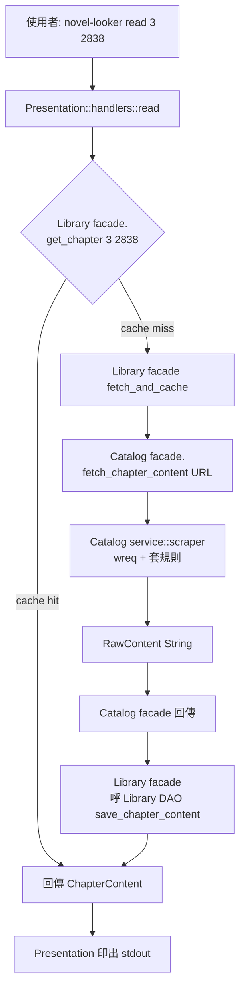
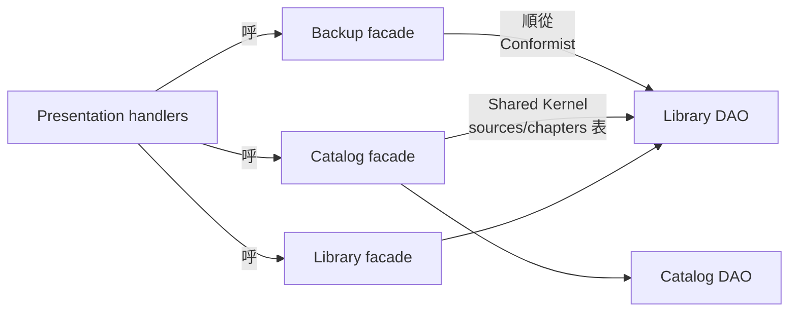
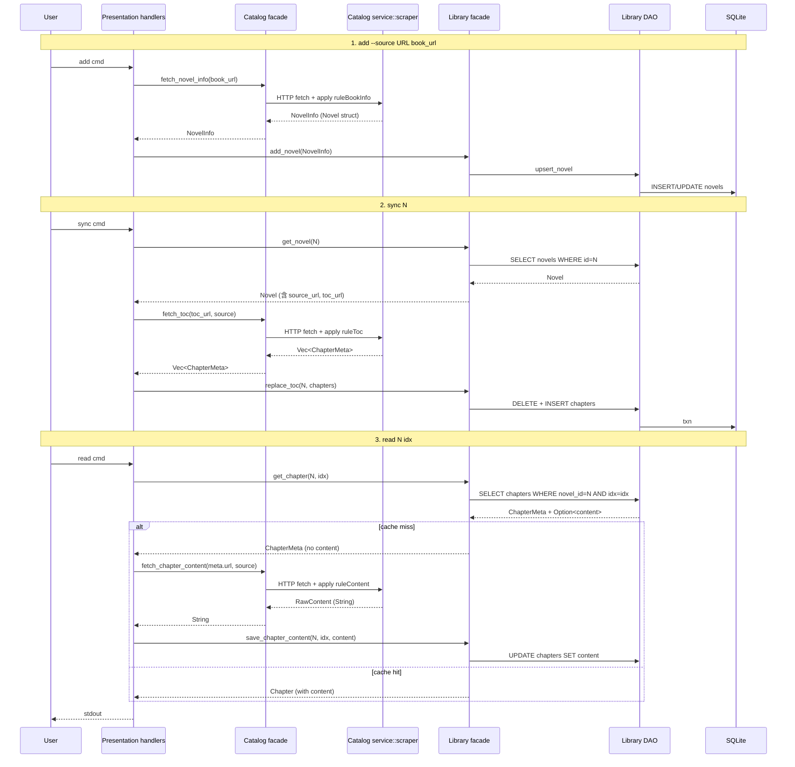
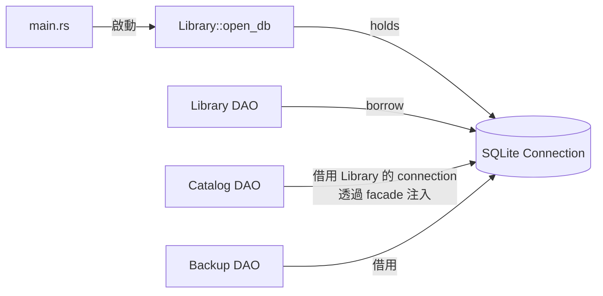
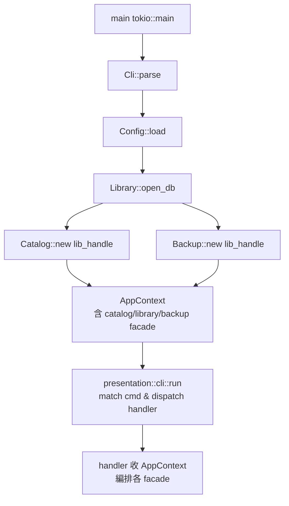

# Design

## 系統架構

重構後的 `src/` 結構：

```
src/
├── main.rs                  # 入口 + module 宣告 + tokio runtime
├── config.rs                # 跨 context 共用設定（root infra）
│
├── utils/
│   ├── mod.rs
│   └── url.rs               # resolve()（從 scraper.rs 搬出；第一個成員）
│
├── catalog/                 # Catalog bounded context
│   ├── mod.rs               # //! Catalog: 描述如何從網站抽資料並執行抽取
│   ├── facade.rs            # search() / fetch_novel_info() / sync_toc() / fetch_chapter_content()
│   ├── dao.rs               # sources 表 CRUD；chapters TOC writes（Shared Kernel 註解）
│   └── service/
│       ├── mod.rs
│       ├── source.rs        # BookSource struct + sub-rules
│       ├── rule.rs          # rule DSL parse + apply
│       └── scraper.rs       # Scraper（wreq + Chrome 131）
│
├── library/                 # Library bounded context (Core)
│   ├── mod.rs               # //! Library: 維護使用者書架 / TOC / 章節快取 / 進度
│   ├── facade.rs            # add_novel() / list_shelf() / get_chapter() / save_progress()
│   ├── dao.rs               # novels / chapters.content / progress 表 CRUD
│   └── service/
│       ├── mod.rs
│       └── shelf.rs         # invariants: TOC sync 不破壞 progress, ChapterCache 必須有對應 TOC entry
│
├── backup/                  # Backup bounded context (4 層 — Conformist 無自有 DAO)
│   ├── mod.rs               # //! Backup: Library 狀態跨機器移動。Conformist of Library — 透過 library::facade 達成 storage access，無自有 DAO 層。
│   ├── facade.rs            # run_backup() / export_to() / import_from()
│   └── service/
│       ├── mod.rs
│       ├── snapshot.rs      # build_backup（read）/ apply_backup（write）+ ACL mapping
│       └── transport.rs     # push_local / push_webdav / prune_local
│
└── presentation/            # Presentation bounded context
    ├── mod.rs               # //! Presentation: CLI + TUI 翻譯人類意圖
    ├── cli.rs               # Cli/Cmd/SubCmd struct + run() dispatcher
    ├── reader.rs            # ReaderApp + event_loop（保留 reading session state pending split）
    └── handlers/
        ├── mod.rs
        ├── source.rs        # SourceCmd::Import / List handler
        ├── search.rs        # search handler
        ├── add.rs
        ├── shelf.rs
        ├── sync.rs
        ├── read.rs
        ├── tui.rs
        ├── config.rs        # ConfigCmd handler
        ├── export.rs
        ├── import.rs
        └── backup.rs
```

**Backup 為何 4 層**：Conformist of Library — Backup 的所有 storage 操作走 `library::facade::*`，沒有自己對 SQL 的直接接觸面，因此**不需要也不該有** `backup/dao.rs`。強行保留會是「為形式而抽象」的空殼，違反 service 不接 SQL 之外應遵循的「層級存在必有實質職責」原則。其他 3 個 context（Catalog / Library / Presentation）維持完整 5 層。

## 整體操作流程

以「使用者讀某一章」為例的 use case 流程：



## 跨 context facade 呼叫拓樸



**關鍵約束**：handler 可呼三個 context 的 facade；**facade 不互呼**（避免 context 間 cycle）；handler 是唯一跨 context 編排點。

## 資料流（add → sync → read 端到端）



## 資料模型

**型別放置策略**（不動 SQL schema，只動 type 所有權的 module 路徑）：

| Type | 從 | 搬至 | 原因 |
|---|---|---|---|
| `BookSource` + 子 rule struct | `src/source/mod.rs` | `src/catalog/service/source.rs` | Catalog 概念 |
| `Rule` / `RuleAlt` / `Accessor` | `src/source/rule.rs` | `src/catalog/service/rule.rs` | Catalog service 內部 |
| `SearchHit` | `src/models.rs` | `src/catalog/mod.rs`（pub re-export 為 PL） | Catalog 對外 PL |
| `Novel` | `src/models.rs` | `src/library/mod.rs`（pub re-export）<br/>Catalog 透過 `library::Novel` 引用 | Library 為 owner；Catalog 共用（Shared Kernel data type；本次不拆 ShelfEntry 留 OQ-6） |
| `ChapterMeta` / `Chapter` | `src/models.rs` | `src/library/mod.rs`（pub re-export）<br/>Catalog 引用 | 同上 |
| `ReadProgress` | `src/models.rs` | `src/library/mod.rs` | Library 專屬 |
| `Scraper` | `src/scraper.rs` | `src/catalog/service/scraper.rs` | Catalog service |
| `Storage` | `src/storage.rs` | **拆成兩個 DAO**：`src/catalog/dao.rs`（sources / chapters TOC writes）+ `src/library/dao.rs`（novels / chapters content / progress）；底層共用一個 SQLite connection helper（在 `src/library/dao.rs` 內提供 `open_db()` factory）| 按資料所有權拆 |
| `Config` + sub-config | `src/config.rs` | **不動，保留 root** | 跨 context 共用 infra |

**Shared Kernel 註解規範**：在 `catalog/dao.rs` 與 `library/dao.rs` 開頭都加 `//! NOTE: Shared Kernel — sources.* 與 chapters.{idx,name,url} 由 Catalog 寫；chapters.content 由 Library 寫。修改任一方 schema 需同步檢視對方 DAO。`

## DB connection 共享策略

**為何不讓每個 context 各自 `Connection::open`：**

1. rusqlite 預設 single-threaded mode；多 Connection 對同 DB 檔在序列操作下會出現 SQLITE_BUSY（雖然短期重試會過，但是垃圾行為）
2. `backup` use case 內部會「先 list_novels → 寫 file → list_chapters」這類跨 DAO 操作，若各自開 connection 會看到不一致 snapshot
3. 共享一條 connection 也讓 `sync + backup` 連續執行不必設 `busy_timeout`（測試項 E14）
4. 重構約束「不動 schema、不引入 WAL」也意味著不能靠 WAL 解 lock — 共享 connection 是最簡解

**不是美學潔癖**——E14 是這個決策的明確驗證點。若 main.rs 改為各 context 自開，E14 在 `sync + backup` 連跑時會 fail。

### Borrow 規則（DAO / facade 函數簽名約定）

rusqlite 對 transaction 要求 `&mut Connection`，DAO 簽名一致性是 refactor 中**最易撞 borrow checker** 的地方。統一規則：

| 操作類型 | 函數簽名 | 範例 |
|---|---|---|
| **唯讀** (SELECT) | `fn xxx(db: &LibraryDb, ...) -> Result<T>` | `list_novels(&db)`, `get_chapter(&db, id, idx)` |
| **單一寫入**（INSERT/UPDATE） | `fn xxx(db: &mut LibraryDb, ...) -> Result<T>` | `upsert_novel(&mut db, n)`, `save_progress(&mut db, p)` |
| **Transaction** (含多步寫入) | `fn xxx(db: &mut LibraryDb, ...) -> Result<T>` | `replace_toc(&mut db, id, chapters)` |

**`LibraryDb` 介面**：
```rust
pub struct LibraryDb { conn: Connection }
impl LibraryDb {
    pub fn open() -> Result<Self> { /* ... */ }
    pub fn conn(&self) -> &Connection { &self.conn }
    pub fn conn_mut(&mut self) -> &mut Connection { &mut self.conn }
}
```

**AppContext 持有規則**：`AppContext { pub db: LibraryDb, ... }` — by value。handler 統一收 `&mut AppContext`（即使該 use case 只 read，也用 `&mut` 給統一性，避免 dispatcher match arm 內混 `&` vs `&mut`）。

**Catalog DAO 也遵循同規則**：例如 `catalog::dao::replace_toc(&mut LibraryDb, ...)`、`catalog::dao::list_sources(&LibraryDb)`。

設計：



具體實作：`Storage`-like wrapper 仍存在於 `library/dao.rs`，公開 `Library::open()` 回傳 owner；`Catalog::new(library_handle)` 與 `Backup::new(library_handle)` 在 constructor 注入。此安排在 main.rs 一次性 wiring。

## 錯誤處理策略

維持現有 anyhow-based 結構（不引入 thiserror domain error），各層職責：

- **DAO 層**：rusqlite::Error 用 `anyhow::Context` 加路徑提示再向上拋
- **Service 層**：domain validation 失敗用 `anyhow::bail!("...")`；爬蟲失敗（HTTP / parse）連同 wreq::Error 加上下文（哪個 URL / 哪條 rule）
- **Facade 層**：聚合多步驟錯誤，不另外包；保留 `?` chain
- **Action / handler 層**：將 anyhow::Error 用 `{e:#}` 印給使用者；exit code 由 anyhow::Result 自動處理

**不引入** 新 error type，因為 KD 7 要求不過早抽象；如 service 之間需要錯誤分類，留下次 refactor（OQ trigger：第二個 caller 出現需要區分錯誤類別時）

## Wiring 點：`main.rs` 怎麼長



`main.rs` 只負責組裝；不知道任何 domain logic。

## Verification: 中間態可編譯保證

`.claude/wip/ddd-analysis.md` §5 Refactor Roadmap 每步要求「保持中間態可編譯可跑」。實踐方式：

- Step 1 (Backup)：在搬 `backup.rs` → `src/backup/` 時，先建立 `src/backup/mod.rs` 內含 `pub use legacy_backup::*;` 別名指向暫存的 `src/backup_legacy.rs`，逐函數遷移
- Step 2 (Catalog)、Step 3 (Library)、Step 4 (Presentation) 同理

**結束時**移除所有 `_legacy` 殘留。

### `_legacy` / TRANSITION 清零 gate（必須通過才能交付）

**統一 transition marker convention**：refactor 過程中所有暫時別名、過渡 re-export、暫留檔案，**強制標** `// TRANSITION:` 註解（含拆完移除的 task 編號）。例如：

```rust
// TRANSITION: removed in task-presentation-02 cleanup
pub use crate::library::dao::LibraryDb as Storage;
```

最終 PR 前執行以下 grep，輸出必須為空：

```bash
grep -rnE "_legacy|legacy_|TRANSITION:|// TODO: remove|MOVED:" src/ 2>/dev/null
```

涵蓋四類痕跡：
1. `_legacy` 後綴的 module 別名
2. `legacy_*` re-export
3. `TRANSITION:` 標記（本次 refactor 主要用這條）
4. `// TODO: remove` / `MOVED:` 等過渡註解

任一存在都視為**未完成**的中間態痕跡，必須移除後才算 refactor 完成。test.md 邊界條件與 task-presentation-04 自檢都會檢這條。

## NOTE: facade 互呼例外（backup → library）

design.md 上面寫「facade 不互呼」是給跨**獨立** context 的通則約束（避免 cycle）。但 Backup 對 Library 的關係是 **Conformist**：Backup 順從 Library 既有 mutation API，這在語義上**就是**「Backup facade 透過 Library facade 操作」的關係。具體實現上：

- `backup/facade::run_backup` **可以**呼 `library::facade::list_novels` / `library::facade::upsert_novel` / `library::facade::save_progress` — 這是 Conformist 的合法表達
- 但 `catalog/facade` 不能呼 `library/facade`（沒有 Conformist 關係，Catalog 與 Library 是 Shared Kernel + 分流 access）
- `presentation/handlers/*.rs` 是跨 context 編排點，可呼任何 context 的 facade

驗證時對 `src/backup/facade.rs` 的 grep 結果**例外處理**：
```bash
grep -rnE "use crate::(catalog|library|backup)::facade" src/*/facade.rs 2>/dev/null | grep -v "src/backup/facade.rs"
```
須無輸出（其他 facade 不互呼；backup facade 例外）。
